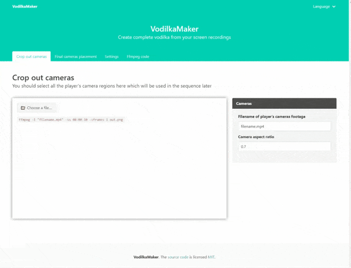

# VodilkaMaker

[](http://hits.dwyl.io/174n/VodilkaMaker)
[](https://github.com/174n/VodilkaMaker/stargazers)
[](https://github.com/174n/VodilkaMaker/issues)
[](https://snyk.io/test/github/174n/VodilkaMaker)
[](https://github.com/174n/VodilkaMaker/blob/master/package.json)

Create complete vodilka from your screen recordings

[DEMO](https://174n.github.io/VodilkaMaker/)



## Project setup
```
npm install
```

### Compiles and hot-reloads for development
```
npm run serve
```

### Compiles and minifies for production
```
npm run build
```

### Run your tests
```
npm run test
```

### Lints and fixes files
```
npm run lint
```

### Customize configuration
See [Configuration Reference](https://cli.vuejs.org/config/).
